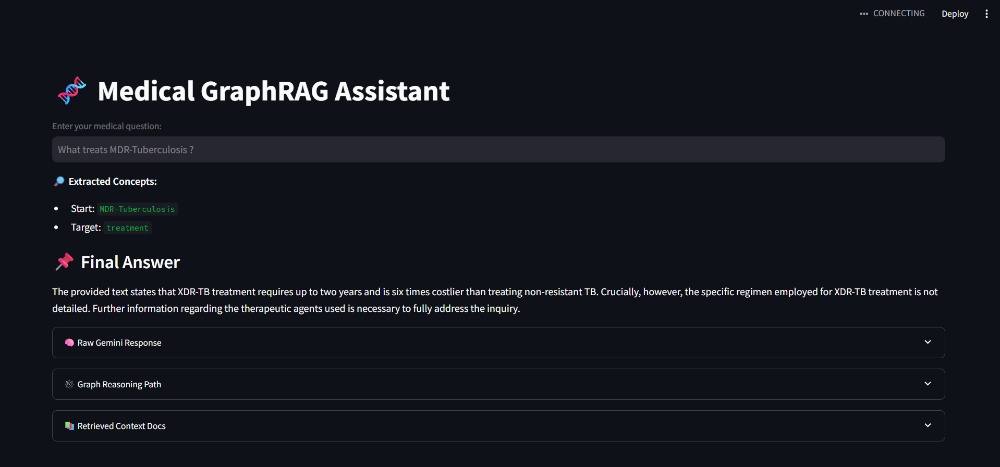

# 🧠 Medical GraphRAG Assistant

A GraphRAG-based application that combines **Vector Search**, **Graph Reasoning**, and **LLM-based Answer Generation** to provide insightful answers to complex medical questions.

Built with:
- 🔍 Pinecone Vector DB
- 🧬 Dgraph + MCTS for graph reasoning
- 💡 Gemini LLM for concept extraction, QA, and answer polishing

---

## 🚀 Features

- **Semantic Search**: Retrieves the most relevant documents using Sentence Transformers and Pinecone.
- **Graph Reasoning**: Traverses a medical knowledge graph using Monte Carlo Tree Search to infer connections.
- **LLM Integration**: Uses Gemini to extract medical entities, answer queries in context, and polish the output.
- **Interactive UI**: Built with Streamlit for ease of use and rapid experimentation.

---

